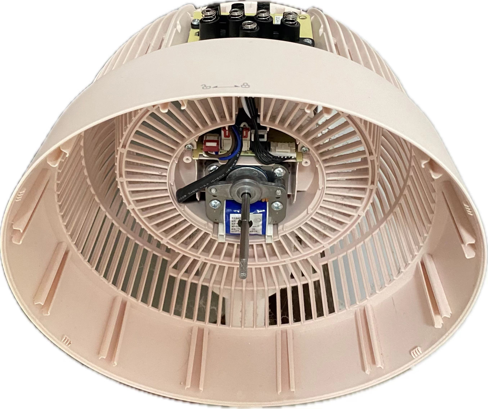

# 循环扇易清洗版

现有循环扇(参考美的循环扇FGA24TYR)存在因为电子元器件与风扇进出风位置强耦合, 导致无法简易拆装, 最终使得清洗风扇进出风位置难度增加的情况(可参考[图片1](#key_part)), 现希望通过重新设计风扇结构(可能需要引入新的电子电路), 以达到以下效果:

1. 电子元器件增强防进灰和防进水保护
2. 电子元器件可以轻松与可能进灰的风扇部件分离

从而获得以下效果:

1. 更好的保护风扇元器件(虽然感觉现在的保护效果也还不错)
2. 方便清洗, 节省时间, 水, 清洗耗材(**最关键的**)
3. 更优秀的设计(maybe)

<figure>
    
    <figcaption>图片1: 风扇的关键部件</figcaption>
</figure>
